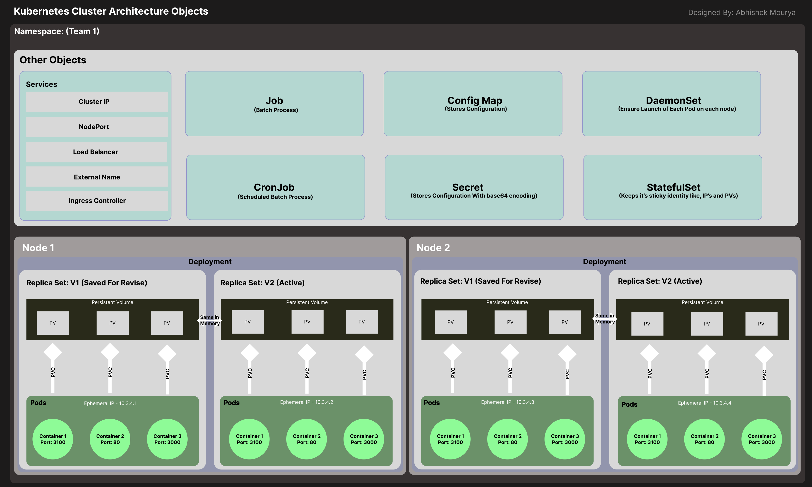
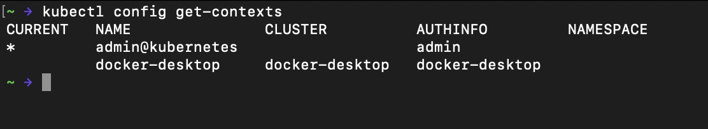
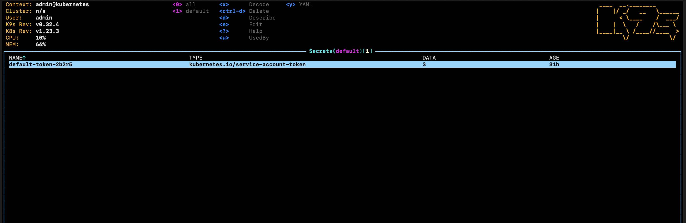
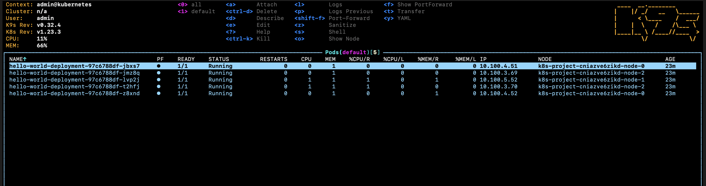
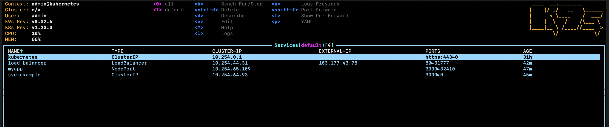
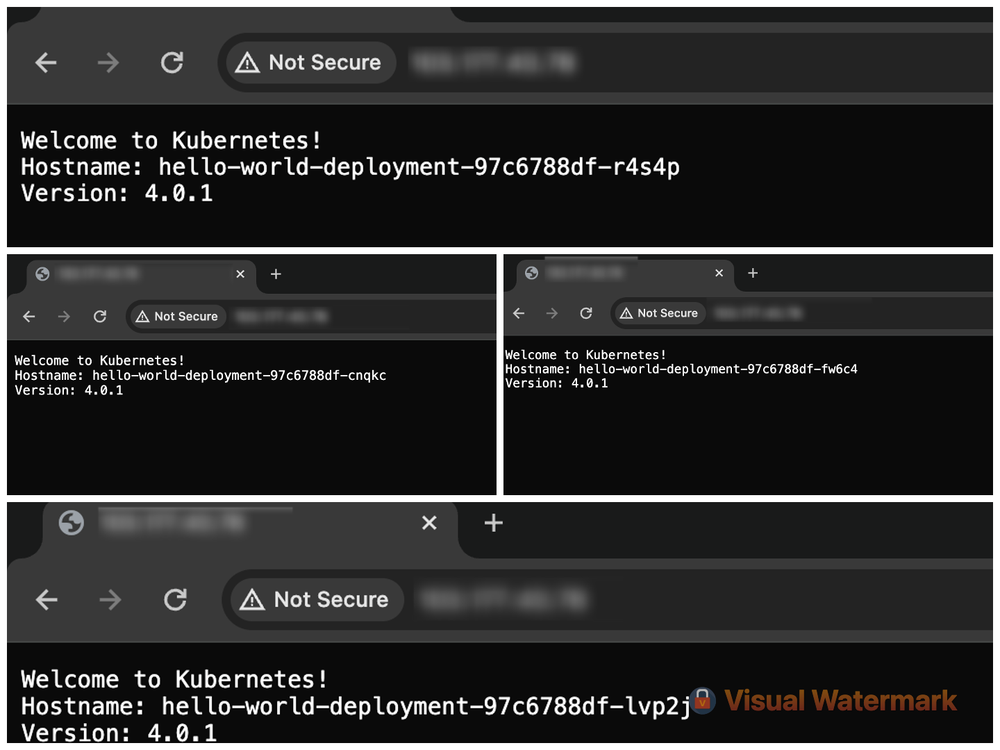

# Learning Kubernetes

Kubernetes is Docker Container Orchestration Tool. Contains very robust architecture and provides a way to automate the replication of container very easily and manage all of them.

## Kubernetes Architecture




It happens with help of the Pods.

## Pods
It is an internal object of the Kubernetes which is an smallest entity in Kubernetes Architecture. It contains multiple containers inside it. 

1. It has an Ephemeral IP Which is an internal ip of the Cluster.
2. All containers inside Pods must run on a different port.
3. A pod can restart Automatically if it's set on it's restart policy.

## Node
A Node is a physical or virtual machine that runs the necessary services to support and manage Pods. Nodes are the worker machines in a Kubernetes cluster, responsible for running the workloads assigned to them.

1. It contains the pods running inside the Kubernetes.
2. Can contain multiple pods.
3. Can be connected to the different Cluster Dynamically

#### Components 
1. Kubelet
2. Kube-proxy
3. Container Runtime

#### Types of Node 

1. Master Node - Managers the Cluster API Server, Run Control Plane Components
2. Worker Node - Run Application Pods

## PV and PVC 

### PV (Persistent Volume)

A **Persistent Volume (PV)** in Kubernetes is a storage resource provisioned within the cluster, serving as a persistent storage solution for applications running in pods. PVs abstract the details of storage provisioning and provide a consistent interface for applications to request and use storage. They ensure that data stored in the cluster persists even if pods are deleted or rescheduled.

### PVC (Persistent Volume Claim)

A **Persistent Volume Claim (PVC)** in Kubernetes is a request for storage by a user or application. It's used to dynamically provision storage resources from available Persistent Volumes (PVs) in the cluster. PVCs abstract the details of storage provisioning and provide a way for applications to request specific storage requirements (like size and access mode) without needing to know the underlying storage implementation details. Once a PVC is created and bound to a PV, the application can use the requested storage for its data, ensuring persistence even if pods are terminated or rescheduled.


### Services

In simple terms, In Kubernetes different Services Provide different ways to expose external traffic to internal pods.

#### Types of services

1. ***LoadBlancer*** - It exposes external traffic from Outside of cluster (Public Traffic) to the cluster.

2. ***ClusterIP*** - Exposes the service on an internal IP address within the cluster. This type of service is only reachable from within the cluster.

3. ***NodePort*** - Exposes the service on a static port on each node's IP address. This type of service is accessible externally, but it's not recommended for production use due to security concerns.

4. ***ExternalName*** - Maps the service to an external DNS name. This type of service is used to access services outside of the cluster.

##### Points to Note:

1. Services use labels and selectors to determine which pods belong to the service. Pods are selected based on labels defined in their metadata.

2. Services have their own lifecycle independent of the pods they route traffic to. They can be created, updated, and deleted separately from the pods.


---
---


# Let's Launch a Simple Hello-world Container in Cloud

## Step 1: Install kubectl in your system which connects to the Kubernetes Cluster

Use the below Install Link Or Search on the google Directly

[Install Link](https://kubernetes.io/docs/tasks/tools/)

---

## Optional Step: 

### If you want to build the image else you can use the image (abhishek6774/hello-world:4.0.1) 

1. Install Docker-Desktop on your system you can follow the official documentation link below

[Docker Desktop Install](https://www.docker.com/products/docker-desktop/)

2. Create A DockerHub Account and a hello-world repository in your account.

3. Login on docker-desktop from cli

```bash
docker login
```

4. 
```bash
cd hello-world-container
docker build . -t <username>/hello-world:tag-name
docker push <username>/hello-world:tag-name
```

## Step 2: Create a Cluster in the cloud of your choice.

## Step 3: Follow the steps provided by the cloud provider to connect to the Cluster. Mostcase secenerio to connect:

1. Cloud Provider will provide **kubeconfig.yml** file in generally.

2. Add it to the environment variable **KUBECONFIG**. if you want you can add the environment variable permananetly.

3. Check the connection 

```bash
kubectl config get-contexts
```

you will see something like this



4. Change the context of the cloud-provider if not selected already to use that cluster using:.

```bash
kubectl config use-context <context-name>
```

example:

```bash
kubectl config use-context admin@kubernetes
```

## Step 3: Install k9s Cli Tool For the View of Changes

[Install K9s Official Link](https://k9scli.io/)



## Step 4: Deployment File

Use the ***deployment.yml*** file

Create a deployment with the below command

```bash
kubectl apply -f deployment.yml
```



## Step 5: Create a LoadBalancer Service to expose the traffic

LoadBalancer Exposes the internal traffic to the outside world and Balance the traffic in different pods so that not one pod will overloaded.

Use the **services/load-balancer.yml** file for creating the load-balancer.




### Result Of Handling External Traffic By Different Pods:
Responses Image




# Conclusion

**Kubernetes** is the one of the best to manage sites high load traffic because of it's best features like **auto-scaling**, **replication**, easy deployment, monitoring, and it's internal network which saves it from external security threats blocking traffic the port which shouldn't be excessed from external network by not exposing it. And it's **services** which provides the best way to expose the traffic using the **labels** and **selectors**.

And You can never forgot about **PV (Persistent Volume)** and **PVC's (Persistent Volume Claims)**, which provide way to save the data which is created by the pod/container.